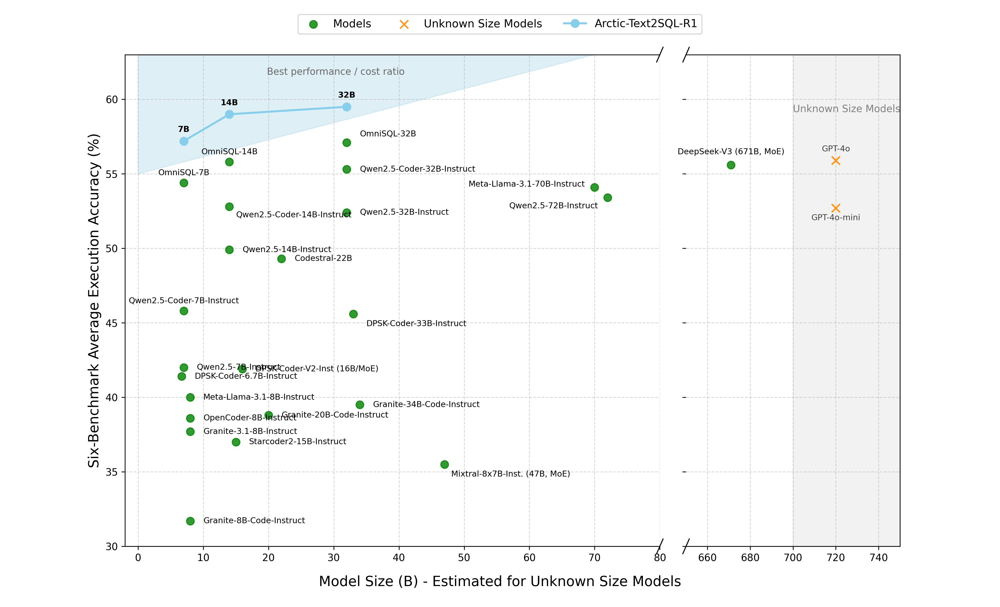

# Arctic-R1 Project: Evaluation

<p align="center">
  
</p>

## Overview

This repository provides a complete demo setup for evaluating **Arctic-Text2SQL-R1** for our [paper](https://arxiv.org/abs/2505.20315).

🚀 Try our released models on Hugging Face:
- [🤗 Arctic-SQL-R1-7B](https://huggingface.co/Snowflake/Arctic-Text2SQL-R1-7B)

⚠️ Note: We currently only support evaluation. The training code and data generation pipeline are not released at this time.


### What's Inside
- **Data Preparation**: Scripts for generating data used in supervised fine-tuning (SFT) and DPO.
- **Evaluation**: Instructions for evaluating Arctic-Text2SQL-R1 on Bird benchmarks:
    - **BIRD**: Benchmark for Instruction-following with Reasoning and Dialogue


## Data Preprocess

### Dev Data Preprocess

1. **Set Up Environment:**
   ```sh
   conda create -n arctic_process_data python=3.9.5
   conda activate arctic_process_data

   apt-get update
   apt-get install -y openjdk-11-jdk

   pip3 install func_timeout ijson tqdm pyserini pyserini==0.22.1 faiss-cpu torch numpy==1.24.3 nltk==3.8.1
   python3 nltk_downloader.py
   ```

2. **Download Datasets:**

Download the following datasets and extract them into a single directory. For the purposes of this tutorial we will assume they are all extracted into `/data/`.

- **BIRD Benchmark**
  - [Dev Set](https://bird-bench.oss-cn-beijing.aliyuncs.com/dev.zip)


3. **Generate Evaluation Input Data**

Here is an example, you should replace with your path

   ```sh
   # Build BM25 index for database values
   python3 data_preprocessing/build_contents_index.py \
   --db-root /BIRD_DIR/dev_20240627/dev_databases \
   --index-root /BIRD_DIR/dev_20240627/db_contents_index \
   --temp-dir /CREATE_TEMP_DIR \
   --threads 16
   ```

   generate input file
   ```
    -i INPUT_JSON       path to input_data_file \
    -o OUTPUT_JSON      path to output_data_file \
    -d DB_PATH          path to the directory of databases \
    -t TABLES_JSON      path to tables definition JSON \
    -s SOURCE           data source name (e.g. "bird") \
    -m MODE             dataset mode (e.g. "dev") \
    -v VALUE_LIMIT_NUM  integer limit for values \
    -c DB_INDEX_PATH    path to db_content_index
   ```
   ```sh
   # Prepare input-output sequences, example here
   bash data_preprocessing/process_dataset.sh \
    -i /BIRD_DIR/dev_20240627/dev.json \
    -o /BIRD_DIR/dev_bird.json \
    -d /BIRD_DIR/dev_20240627/dev_databases/ \
    -t /BIRD_DIR/dev_20240627/dev_tables.json \
    -s bird \
    -m dev \
    -v 2 \
    -c /BIRD_DIR/dev_20240627/db_contents_index
   ```


### Evaluation Reproduction
You can easily reproduce our evaluation results as follows:

1. **Set Up Environment:**
   ```sh
   conda create -n arctic_eval python=3.9.5
   conda activate arctic_eval
   pip3 install vllm func_timeout tqdm matplotlib nltk==3.8.1 sqlparse pandas
   ```

2. **Run Evaluation:**
Here is an example of evaluation a model, please replace the input paraments
   ```bash
   python3 bird_eval/eval_open_source_models.py \
   --models Snowflake/Arctic-Text2SQL-R1-7B \
   --input_file /BIRD_DIR/dev_bird.json \
   --gold_file_path /BIRD_DIR/dev_20240627/dev.json \
   --dp_path /BIRD_DIR/dev_20240627/dev_databases \
   --self_consistency
   ```


## Acknowledgments

This project incorporates code adapted from [OmniSQL – Synthesizing High-quality Text-to-SQL Data at Scale](https://github.com/RUCKBReasoning/OmniSQL) by RUCKBReasoning.
Please see their repository for license details and further usage guidelines. This repo builds on code from OmniSQL (Apache 2.0, see link above).
