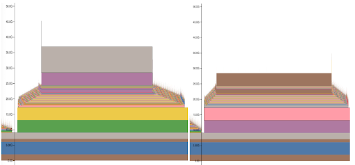
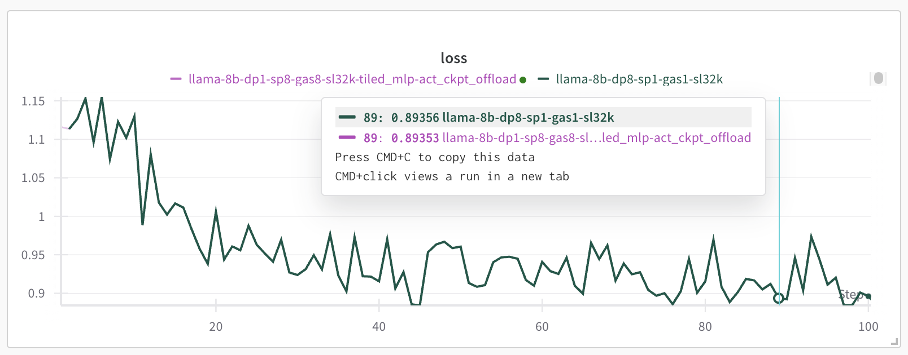

# Arctic Long Sequence Training (ALST) for HF Transformers Usage

There are two parts to Arctic Long Sequence Training (ALST):

1. Ulysses Sequence Parallelism for HF Transformers implements an efficient way of processing long sequences by employing sequence parallelism and attention head parallelism. This is enabled with [sequence_parallel_size](#sequence_parallel_size)
2. Arctic Long Sequence Training (ALST) enables even longer sequence lengths using a bag of tricks:
- [Activation checkpoint offload to CPU](#activation_checkpoint_cpu_offload)
- [Tiled MLP compute](#tiled_mlp_compute)
- [Liger-kernel](#liger-kernel)
- [PYTORCH_CUDA_ALLOC_CONF](#PYTORCH_CUDA_ALLOC_CONF)

[README.md](README.md) contains multiple ready-to-run examples for you to start from and which you can then adapt to your needs as explained in this document.

## Configuration

### sequence_parallel_size

Define the desired sequence parallelism degree in the config yaml file with:
```
sequence_parallel_size: 8
```
The degree of sequence parallelism shouldn't exceed the total number of GPUs.

You can use fewer than the total number of GPUs for sequence parallelism, as long as the number is not bigger than the number of query attention heads.

The number of query attention heads has to be divisible by this number.

If you have more GPUs than the number of query attention heads, set this value to the number of query attention heads and the system will use data parallelism, so you will have multiple SP-replicas.

For example with query heads of 32 and 64 GPUs you could do:
```
sequence_parallel_size: 32
```
which would lead to 2 replicas.


### activation_checkpoint_cpu_offload

To enable activation checkpoint offload to CPU, add:
```
activation_checkpoint_cpu_offload: true
```

Beware that this feature requires an ample CPU memory when working with very large sequence lengths. If you get a cpu_oom event (and not GPU OOM) it means you run out of CPU memory and you need to reduce your sequence length.

If you have very little CPU memory it's likely you shouldn't be enabling this feature.

### tiled_mlp_compute

To enable tiled MLP compute add:
```
tiled_mlp_compute: true
```

### liger-kernel

For most efficient throughput install `pip install liger-kernel` and enable it in the model section. For example:

```
model:
  type: "liger"
  name_or_path: TinyLlama/TinyLlama-1.1B-Chat-v1.0
```


## Additional memory efficiency notes

### PyTorch versions

In general different PyTorch versions are likely to have a different memory footprint, so sometimes it helps to try a few different versions via upgrade and downgrade and to see which one uses the least amount of GPU memory.

For example,  there is a 4GB leak in `torch.distributed` when `barrier` is called on GPU0 w/ 8 GPU-nodes - it doesn't exist in pt-2.4, but is there in 2.6*, 2.7.0. The bug fix will appear in 2.7.1 and 2.8.

### PYTORCH_CUDA_ALLOC_CONF

Before launching your script add:
```
export PYTORCH_CUDA_ALLOC_CONF=expandable_segments:True
```
This will help with minimizing memory fragmentation and will allow a longer sequence length.


## Performance

### Efficient logits+loss calculation

Normally when loss is calculated for a long seqlen it consumes a huge amount of memory. For example, let's take `seqlen=128_000` - when split 8-way, each rank will compute a seqlen shard of 16000. Now with [Llama-3.1-8B-Instruct](https://huggingface.co/meta-llama/Llama-3.1-8B-Instruct/blob/main/config.json) that has a vocab of `128_256` at fp32 this is:

```
18750*4*128256/2**30 = 7.64GB
```

Let's next look at the memory profiler report for the loss computation with and without computation tiling:



You can see a lot more memory consumed on the left snapshot that didn't tile the loss the computation.

Arctic Training will automatically use the memmory efficient implementation when Ulysses is used (`sequence_parallel_size>1`), you don't need to enable anything.

If you have `liger-kernel` installed, it'll be used automatically as it has a more efficient Triton kernel to do the same. Otherwise it'll fallback to using `sequence_tiled_compute`, which is the same as `MLPCompute` but used to compute logits+loss in a sharded fashion.

### Batch seqlen

While the batch seqlen has to be divisible by sequence parallel size, ideally you also want it to be divisible by a largish `2**x` - e.g. 256 to have the fastest matrix multiplication.

So together, try to have it divisible by `256*sequence_parallel_size` if it works out, if not any `2**x*sequence_parallel_size` (where `x>=0`) will do functionally-wise.


## Performance vs. Correctness

In general the longer the sequence the higher the TFLOPS performance will be, because `matmul`s will dominate the compute.

### Longer Sequence Length at the potential loss of correctness

By default deepspeed will use fp32 for sequence parallelism communications.

If you set `"reduce_bucket_size": 5e8` in deepspeed config (default) - at bf16 (2 bytes per param) this will use 1GB of memory to reduce gradients (`2*0.5**9`). But at fp32 (4 bytes per param) this will require additional 4GB of memory:
1. 2GB to copy bf16 to fp32 grads
2. 2GB to reduce them

So if you need to push the sequence length and want to shave some GBs off to accomodate a longer sequence length you can do 2 things:

1. sacrify some of the correctness by forcing the sequence parallelism reductions to be performed in bf16, by setting:
```
"seq_parallel_communication_data_type": 'bf16'
```
in the deepspeed config.

2. or you can sacrify some speed, by reducing the `reduce_bucket_size` - for example, if you set it to:
```
"reduce_bucket_size": 1.25e8
```
which makes the reduction bucket 4x smaller than `5e8` you will incur only 1GB of additional GPU memory to perform the reduction instead of 4GB, because now you have
1. 0.5GB to copy bf16 to fp32 grads
2. 0.5GB to reduce them


### Testing correctness

If you want to ensure you get the same outcome with and without ALST, you can easily perform the comparison. For example for 8 GPUs you'd use the same config yaml, with the exception of these lines:

```
# non-ALST
sequence_parallel_size: 1
gradient_accumulation_steps: 1
#activation_checkpoint_cpu_offload: true
#tiled_mlp_compute: true
```
vs.
```
# ALST
sequence_parallel_size: 8
gradient_accumulation_steps: 8
activation_checkpoint_cpu_offload: true
tiled_mlp_compute: true
```

The first setup will run DP=8, SP=1, GAS=1.

The second setup will run DP=1, SP=8, GAS=8

At each iteration either setup will process the exact same data. We use GAS=8 because UlyssesSP will use all 8 GPUs to process a single sample.

For `max_length` you'd have to choose the highest value supported by non Ulysses setup.

For 8x H100 GPUs you can use this yaml config: [run-sp1-llama-8b-baseline.yml](run-sp1-llama-8b-baseline.yml) as the foundation for the proposed correctness test.

You should see an almost identical loss for both configs as shown in this plot:


